= Introduction to Linux

== Testing Linux Distros

Several methods

[role="incremental"]
- Virtual Box

- Live CD/DVD

- Bootable USB drive

- Spare computer (native install; dual or single boot)

[role="incremental"]
We'll use Virtual Box for this presentation

== The VirtualBox site

Note:

- the "Downloads" link
- the "End-user docs" link
- the "News Flash" section

.The website
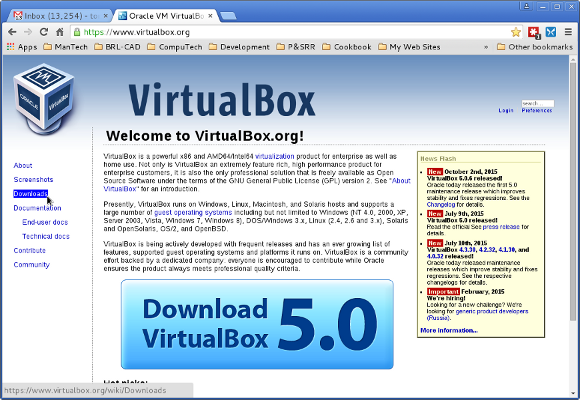

== After selecting "Downloads"

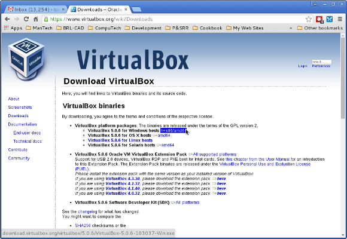

== Don't forget the "Extension Pack" (for USB 2/3; not distributable)

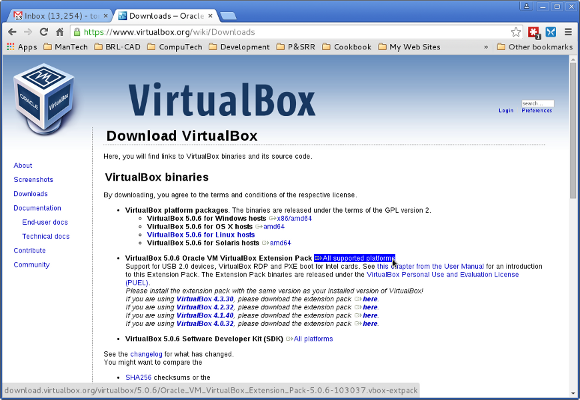

== Upgrading or installing

When upgrading or installing, you lose network access temporarily.
You may have to uninstall an old version when upgrading.

== Selecting the Linux distro

Considerations (* recommended)

- amount of RAM (* 2 GB+)
- 32- or 64-bit (* 64-bit)
- 64-bit guest on 32-bit host? (NOT recommended)
- type network interface (remote access needed?)

== Installing the Linux guest...

.Creating a new Virtual Machine (VM)
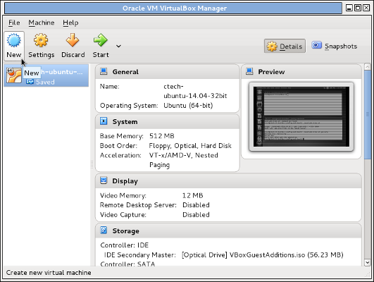

== Naming the VM

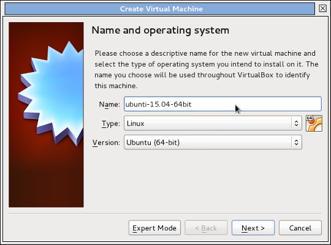

== Choose RAM allocation

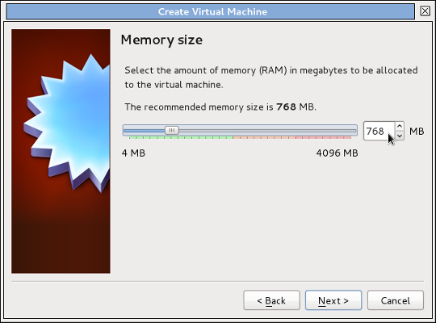

== May need at least 1.5 Gb

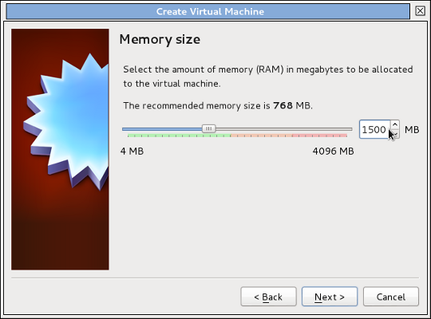

== Select "Next"

== Creating a virtual hard disk

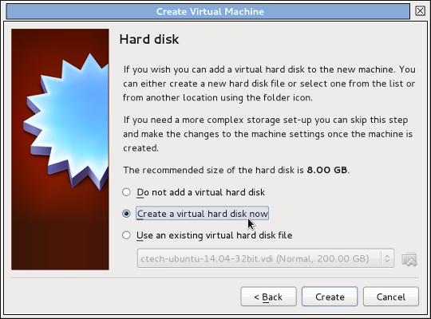

== Use the default disk type (VDI)

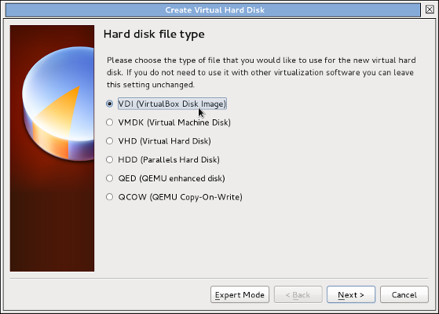

== Select "Next"

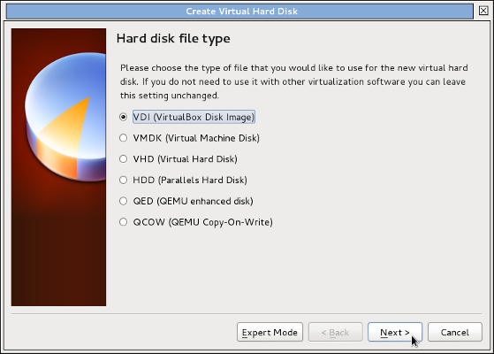

== Choose "Dynamically allocated"

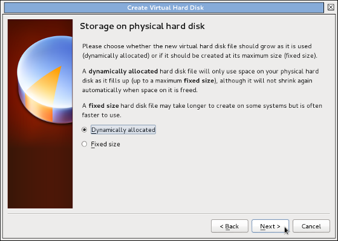

== Normally accept the default name

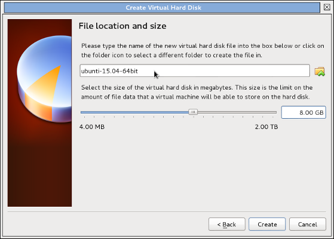

== Be generous selecting disk size

.Then select "Create"

== The new VM appears in the list

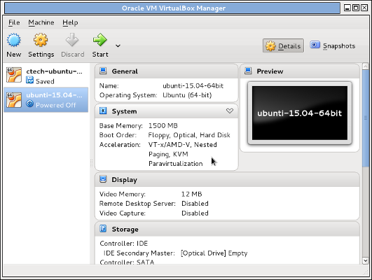

== More VM settings to be made

image::./html/vbox-14.png[]

== System options

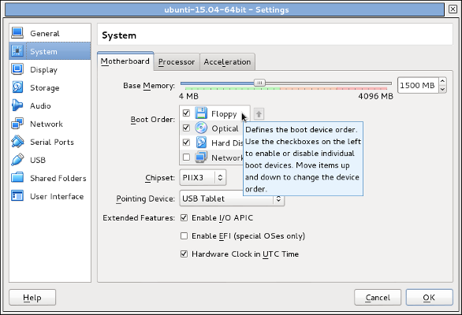

== Display options

.I normally choose 24 Mb
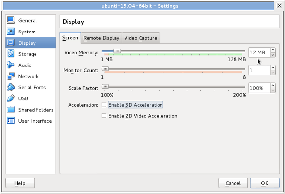

== Attach the installation CD/DVD

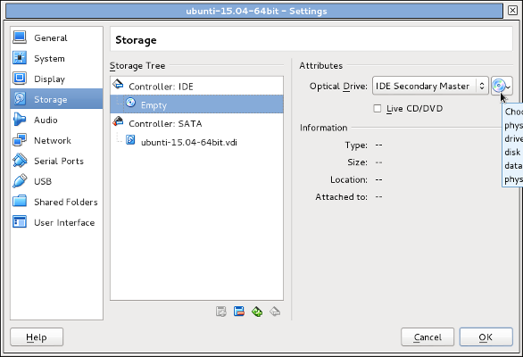

== Navigate to the location

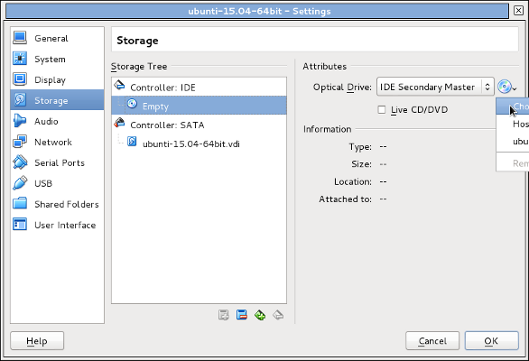

== Select the desired CD/DVD

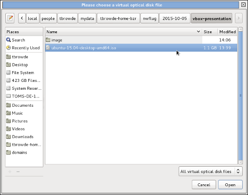

== Check the desired CD/DVD shows as attached

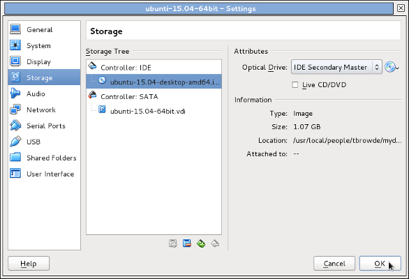

== Now start the VM

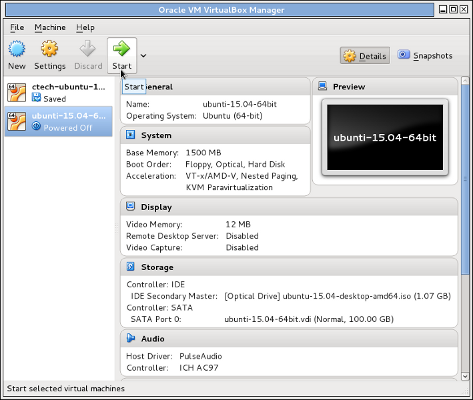

== Oops!

I made a typo on the guest name.  We can rename the host easily,
but we have to remove the disk and create a new one to rename it,
which is too complicated for me.  

The easiest thing to do is to start all over again and use the correct
spelling OR accept the misspelled hard disk name.

== After installation

After starting and finishing the installation, you'll want to install
"Guest Additions" to have the windowing and other features work well.

Please experiment and read the excellent documentation--there's much
more that can be done to tweak a host but this should get you started.

== The end

That's all, folks!
